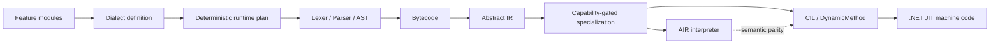

# LangDev 2026 talk materials

## Build the Language, Then Make the Abstractions Disappear

**Extensible Programming on .NET**

> The REBASE 2026 adaptation has a separate [reviewer landing page, submission, and 30-minute outline](../rebase-2026/README.md). This directory remains the original LangDev-specific evidence packet and shared reproducible demonstration.

UniversalToolchain explores a practical form of extensible programming: language features are authored as independent modules, composed into a restricted dialect, progressively lowered through Bytecode and Abstract IR, and executed either by an AIR interpreter or by a CIL backend built on `DynamicMethod`.

The central question of the talk is:

> Can extension machinery remain visible while a language is being built, yet disappear from the execution hot path without allowing different backends to define different semantics?

## Sixty-second reviewer path

1. Read the [submitted abstract](submission.md).
2. Review the [architecture and evidence map](#architecture-and-evidence-map).
3. Run the complete demonstration:

```bash ci-run=false
./docs/talks/langdev-2026/run-demo.sh
```

4. Follow the [module-to-CIL lowering walkthrough](lowering-walkthrough.md).
5. Read the [semantic-parity regression case study](parity-regression.md).
6. Review the [benchmark evidence and limitations](benchmark-evidence.md).

## What the demonstration proves

The reproducible demonstration covers:

- a pricing formula evaluated by hardcoded C# and by two Wist dialect paths;
- a restricted pricing dialect rejecting a statement-style binding feature that was not selected;
- interpreter/compiler parity for external bindings, local variables, local shadowing, nested scopes, and compiled artifacts;
- the distinction between language composition, semantic lowering, optimization, and backend execution.

The demonstration does **not** claim that restricted dialects are security sandboxes, that every Wist program performs like handwritten C#, or that generic third-party DSL authoring is already fully stabilized.

## Architecture and evidence map



| Talk claim | Public evidence |
|---|---|
| A restricted dialect is assembled from selected language/runtime capabilities | [`PricingRestrictedDialectExecutionTests.cs`](https://github.com/Misha1302/Wist2/blob/87952b9c77a91ebfb6deab2d953259798ae7d2e2/UniversalToolchain/UniversalToolchain.Dialects.Tests/PricingRestrictedDialectExecutionTests.cs) |
| The same selected language can execute through interpreter and CIL paths | [`WistDialectExecutionParityTests.cs`](https://github.com/Misha1302/Wist2/blob/87952b9c77a91ebfb6deab2d953259798ae7d2e2/UniversalToolchain/UniversalToolchain.Dialects.Tests/Wist/WistDialectExecutionParityTests.cs) |
| External bindings and local storage must remain semantically distinct | [`InterpreterBindingsParityTests.cs`](https://github.com/Misha1302/Wist2/blob/87952b9c77a91ebfb6deab2d953259798ae7d2e2/UniversalToolchain/Tests/Backends/InterpreterBindingsParityTests.cs) |
| Compiled artifacts preserve interpreter/compiler semantics | [`RuntimeCompiledArtifactParityTests.cs`](https://github.com/Misha1302/Wist2/blob/87952b9c77a91ebfb6deab2d953259798ae7d2e2/UniversalToolchain/Tests/Backends/RuntimeCompiledArtifactParityTests.cs) |
| The public pricing scenario compares hardcoded C#, general Wist, and a restricted dialect | [`PricingDiscountScenario.cs`](https://github.com/Misha1302/Wist2/blob/87952b9c77a91ebfb6deab2d953259798ae7d2e2/UniversalToolchain/Example/Scenarios/PricingDiscountScenario.cs) |
| Public performance claims are limited to already prepared arithmetic artifacts | [benchmark contract](https://github.com/Misha1302/Wist2/blob/87952b9c77a91ebfb6deab2d953259798ae7d2e2/UniversalToolchain/Benchmarks/UniversalToolchain.Benchmarks/README.md) |

## Reproducible command

Requirements:

- .NET SDK 10.x;
- Bash;
- a network connection for the initial NuGet restore, unless packages are already cached.

From the repository root:

```bash ci-run=false
./docs/talks/langdev-2026/run-demo.sh
```

The script restores and builds the solution, runs the pricing demonstration, checks its expected output, and executes the focused parity suites used by the talk.

Expected high-level result:

```text
Pricing results match.
The restricted dialect rejects the unsupported binding shape.
All focused interpreter/CIL parity and restricted-dialect suites pass.
```

The exact console shape produced by the current pricing demonstration is recorded in [expected-output.txt](expected-output.txt). The test runner reports the currently discovered test count; the documentation intentionally does not hard-code a count that may change as regression coverage grows.

## Talk structure

The planned 25-minute structure and fallback strategy are in [talk-outline.md](talk-outline.md).

## Current project boundary

UniversalToolchain is the reusable framework. Wist is the reference language, proving ground, and integration surface.

The current project demonstrates a strong Wist-first architecture for modular language composition, manifest-backed runtime selection, interpreter/CIL execution, capability-gated specialization, and semantic-parity testing. Generic outsider-friendly DSL authoring and fully backend-agnostic artifact handling remain active design areas rather than completed claims.
