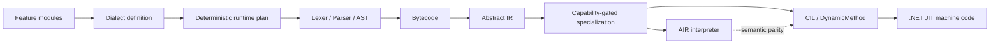

# REBASE 2026 talk proposal

## Build the Language, Then Make the Abstractions Disappear

**Engineering an Extensible .NET DSL Runtime**

UniversalToolchain/Wist2 is an independent open-source .NET compiler/runtime project for restricted formulas and small domain-specific languages. This REBASE proposal presents an applied architecture and a reproducible implementation case study rather than a production-deployment claim.

The central question is:

> Can language features remain independently composable while a dialect is being built, then become concrete before execution without allowing the interpreter and compiler to define different languages?

## Two-minute reviewer path

1. Read the exact [submitted title, abstract, and speaker bio](submission.md).
2. Review the architecture and evidence map below.
3. Inspect the [30-minute talk outline](talk-outline.md).
4. Run the shared reproducible demonstration from the repository root:

```bash ci-run=false
./docs/talks/langdev-2026/run-demo.sh
```

5. Follow the shared [module-to-CIL lowering walkthrough](../langdev-2026/lowering-walkthrough.md).
6. Read the [semantic-parity regression case study](../langdev-2026/parity-regression.md).
7. Review the [performance measurement boundary](../langdev-2026/benchmark-evidence.md).

The `langdev-2026` directory is retained as the original event-specific evidence packet. REBASE reuses its reproducible technical material while providing a separate abstract, reviewer path, and 30-minute structure.

## Contribution

The talk presents four connected engineering decisions:

1. **Construction-time extensibility.** Language features own syntax and semantic contributions and are selected into a restricted dialect.
2. **Explicit lowering boundaries.** Bytecode separates frontend composition from Abstract IR, which exposes operations to optimizers and execution backends.
3. **Capability-gated specialization.** Supported operations become concrete interpreter operations or typed CIL emitted through `DynamicMethod`; unsupported specialization leaves the portable representation intact.
4. **One semantics across runtimes.** The interpreter acts as a semantic reference path, while cross-backend tests protect external bindings, lexical locals, shadowing, nested scopes, and compiled artifacts.

## Architecture



The precise hot-path claim is bounded: for supported compiled paths, feature-module selection and plugin dispatch are construction-time mechanisms. The prepared artifact executes lowered typed operations; this is not a claim that every helper is inlined or that every Wist program matches handwritten C# performance.

## Demonstration and evidence

Code evidence snapshot: [`b965466e1880a2d3a9172972e05d2cbd740c891a`](https://github.com/Misha1302/Wist2/tree/b965466e1880a2d3a9172972e05d2cbd740c891a).

| Talk claim | Public evidence |
|---|---|
| A restricted dialect is assembled from selected language/runtime capabilities | [`PricingRestrictedDialectExecutionTests.cs`](https://github.com/Misha1302/Wist2/blob/b965466e1880a2d3a9172972e05d2cbd740c891a/UniversalToolchain/UniversalToolchain.Dialects.Tests/PricingRestrictedDialectExecutionTests.cs) |
| The same selected language executes through interpreter and CIL paths | [`WistDialectExecutionParityTests.cs`](https://github.com/Misha1302/Wist2/blob/b965466e1880a2d3a9172972e05d2cbd740c891a/UniversalToolchain/UniversalToolchain.Dialects.Tests/Wist/WistDialectExecutionParityTests.cs) |
| External bindings and local storage remain semantically distinct | [`InterpreterBindingsParityTests.cs`](https://github.com/Misha1302/Wist2/blob/b965466e1880a2d3a9172972e05d2cbd740c891a/UniversalToolchain/Tests/Backends/InterpreterBindingsParityTests.cs) |
| Compiled artifacts preserve interpreter/compiler semantics | [`RuntimeCompiledArtifactParityTests.cs`](https://github.com/Misha1302/Wist2/blob/b965466e1880a2d3a9172972e05d2cbd740c891a/UniversalToolchain/Tests/Backends/RuntimeCompiledArtifactParityTests.cs) |
| The public pricing scenario compares hardcoded C#, general Wist, and a restricted dialect | [`PricingDiscountScenario.cs`](https://github.com/Misha1302/Wist2/blob/b965466e1880a2d3a9172972e05d2cbd740c891a/UniversalToolchain/Example/Scenarios/PricingDiscountScenario.cs) |
| Performance claims separate prepared invocation, convenience evaluation, and compilation cost | [benchmark contract](https://github.com/Misha1302/Wist2/blob/b965466e1880a2d3a9172972e05d2cbd740c891a/UniversalToolchain/Benchmarks/UniversalToolchain.Benchmarks/README.md) |

The demonstration covers:

- deterministic dialect/runtime-plan inspection;
- a pricing formula executed through the general and restricted language paths;
- rejection of a feature that the restricted dialect did not select;
- interpreter/compiler parity for external bindings, local variables, shadowing, nested scopes, and compiled artifacts;
- the distinction between language composition, semantic lowering, optimization, and backend execution.

## Applied relevance

The architecture and failure mode apply beyond Wist. Expression evaluators, rules engines, query compilers, template runtimes, and tiered language implementations face the same boundary: a more concrete execution path must be allowed to change representation without redefining observable semantics.

The talk leaves the audience with reusable rules for locating semantic ownership, querying backend capabilities instead of concrete backend names, separating local and external storage identities, and validating parity across dialect and optimizer configurations.

## Current boundary

UniversalToolchain is the reusable framework; Wist is its reference language and proving ground. The current alpha demonstrates modular language composition, deterministic runtime selection, Bytecode-to-AIR lowering, interpreter/CIL execution, capability-gated specialization, and semantic-parity testing.

The proposal does **not** claim:

- production deployment or a stable 1.0 API;
- hardened in-process sandboxing for hostile code;
- fully stabilized generic third-party DSL authoring;
- universal performance parity with handwritten C#;
- benchmark conclusions outside the recorded scenario and environment.
