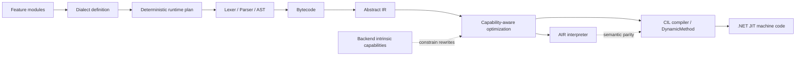

# REBASE 2026 talk proposal

Status: proposal.

## Build the Language, Then Make the Abstractions Disappear

**From Feature Modules to Typed CIL**

UniversalToolchain/Wist2 builds restricted .NET DSLs from independently selected feature modules. Module selection defines the language before execution. Programs are then lowered through Bytecode and Abstract IR; AIR can be interpreted directly or compiled to typed CIL emitted with `DynamicMethod`.

The difficult part is keeping those paths as one language. A real regression involving external bindings, lexical locals, and shadowing exposed how backend storage choices had leaked into semantics. That failure makes the boundary between language construction, lowering, backend specialization, and semantic verification concrete.

## Reviewer path

1. Read the exact [title, abstract, and speaker bio](submission.md).
2. Review the architecture and evidence below, then inspect the [30-minute outline](talk-outline.md).
3. From the repository root, run the shared demonstration:

```bash ci-run=false
./docs/talks/langdev-2026/run-demo.sh
```

Supporting technical material:

- [module-to-CIL lowering walkthrough](../langdev-2026/lowering-walkthrough.md);
- [semantic-parity regression case study](../langdev-2026/parity-regression.md);
- [performance measurement boundary](../langdev-2026/benchmark-evidence.md).

The original `langdev-2026` directory remains the shared technical evidence packet. Its documents retain their original event history; the claim-to-code links on this page are the authoritative evidence map for the REBASE proposal.

## What the talk shows

- Feature modules own syntax and semantic contributions, and a dialect selects the allowed language surface.
- Bytecode is the frontend composition boundary; AIR is the optimizer and backend boundary.
- The demonstrated native-load optimizer queries intrinsic capabilities before replacing portable AIR with typed load operations; it does not branch on concrete backend types.
- The interpreter is the reference execution path, while cross-backend tests protect external bindings, lexical locals, shadowing, nested scopes, and compiled artifacts.

## Architecture



For supported compiled paths, module selection and plugin dispatch happen during language and runtime preparation. The generated delegate executes emitted CIL rather than consulting the module registry for each operation. This claim does not imply universal JIT inlining or handwritten-C# performance.

## Demonstration and evidence

All claim-to-code links below are pinned to one code evidence snapshot: [`499529af506939c8047387e3f05598459bd7edfd`](https://github.com/Misha1302/Wist2/tree/499529af506939c8047387e3f05598459bd7edfd).

| Claim | Public evidence |
|---|---|
| A restricted dialect is assembled from selected language/runtime capabilities | [`PricingRestrictedDialectExecutionTests.cs`](https://github.com/Misha1302/Wist2/blob/499529af506939c8047387e3f05598459bd7edfd/UniversalToolchain/UniversalToolchain.Dialects.Tests/PricingRestrictedDialectExecutionTests.cs) |
| The same selected language executes through interpreter and CIL paths | [`WistDialectExecutionParityTests.cs`](https://github.com/Misha1302/Wist2/blob/499529af506939c8047387e3f05598459bd7edfd/UniversalToolchain/UniversalToolchain.Dialects.Tests/Wist/WistDialectExecutionParityTests.cs) |
| External bindings and local storage remain semantically distinct | [`InterpreterBindingsParityTests.cs`](https://github.com/Misha1302/Wist2/blob/499529af506939c8047387e3f05598459bd7edfd/UniversalToolchain/Tests/Backends/InterpreterBindingsParityTests.cs) |
| Compiled artifacts preserve interpreter/compiler semantics | [`RuntimeCompiledArtifactParityTests.cs`](https://github.com/Misha1302/Wist2/blob/499529af506939c8047387e3f05598459bd7edfd/UniversalToolchain/Tests/Backends/RuntimeCompiledArtifactParityTests.cs) |
| The pricing scenario compares hardcoded C#, general Wist, and a restricted dialect | [`PricingDiscountScenario.cs`](https://github.com/Misha1302/Wist2/blob/499529af506939c8047387e3f05598459bd7edfd/UniversalToolchain/Example/Scenarios/PricingDiscountScenario.cs) |
| Native-load rewrites are gated by intrinsic capabilities and preserve unmatched AIR | [`NativeCilOptimizerModule.cs`](https://github.com/Misha1302/Wist2/blob/499529af506939c8047387e3f05598459bd7edfd/UniversalToolchain/NativeMathModule/NativeCILOptimizerModule.cs) |
| Performance measurements separate prepared invocation, convenience evaluation, and compilation cost | [benchmark contract](https://github.com/Misha1302/Wist2/blob/499529af506939c8047387e3f05598459bd7edfd/UniversalToolchain/Benchmarks/UniversalToolchain.Benchmarks/README.md) |

The pricing demo inspects the selected runtime plan, compares hardcoded C# with general and restricted Wist dialects, and rejects a feature excluded from the restricted dialect. The focused regression suites separately exercise lexical locals, shadowing, nested scopes, external bindings, and interpreter/CIL parity. Together, these steps keep language composition, semantic lowering, optimization, and backend execution visibly separate.

## Why the failure matters

Any runtime with interpreted and compiled paths can change representation without intending to change meaning. The binding regression shows one concrete way this happens: external values and lexical locals acquire different physical layouts, and backend allocation accidentally becomes observable language behavior. The fix is to define semantic identities before backend storage allocation and test parity across scope, storage, dialect, and optimizer variations.

## Current limits

UniversalToolchain is the reusable framework; Wist is its reference language and proving ground. The project is an open-source alpha, not a production deployment report or a hardened in-process sandbox. The Wist-first path is more mature than generic third-party DSL authoring. The API is not yet a stable 1.0 contract, and performance conclusions are limited to explicitly recorded scenarios and environments.

Delivery and fallback details are kept separately in [speaker preparation notes](speaker-notes.md).
