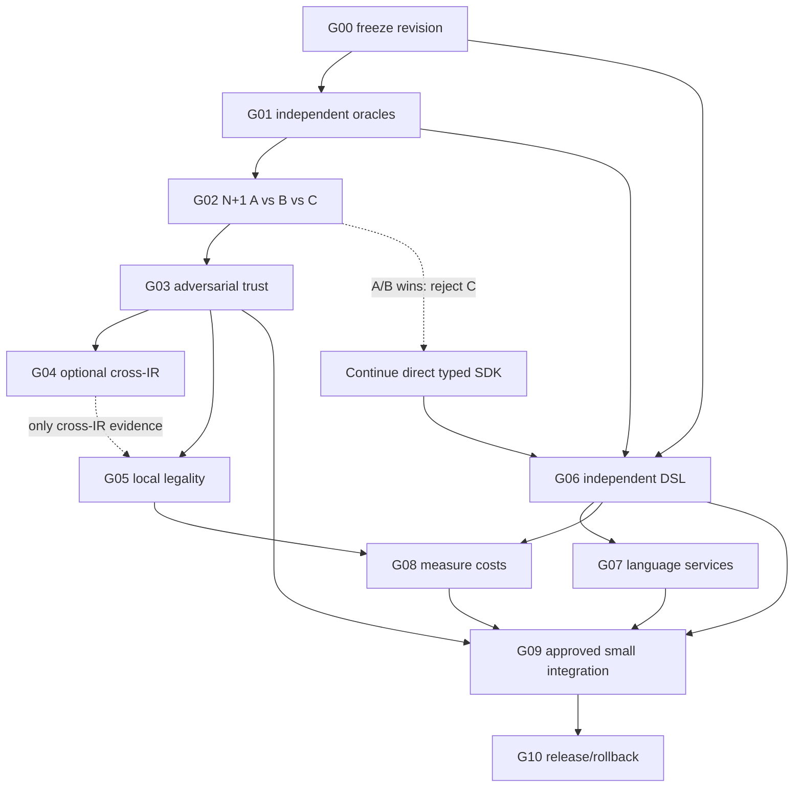

# Dependencies and critical path — conditional DAG

**Owner:** gate ordering only. Canonical pass/abort definitions are in [ROADMAP.md](ROADMAP.md) and [DEFINITION_OF_DONE.md](DEFINITION_OF_DONE.md). A failing optional experiment does not block a productive direct-typed SDK.

**Important:** solid diagram edges show possible dependencies, not all simultaneously mandatory requirements. G09 has **OR** activation: verified semantics path (G02, G03, G05) **or** authoring/product path (G06, G07). G08 is mandatory only if performance is a material promotion claim. G04 only if evidence transfer between different representations is part of the approved slice. Neither a proof service nor G02 success is mandatory for authoring work.

| Edge / branch | Class | Justification | Blocked if |
|---|---|---|---|
| G00→G01→G02 | hard (semantic track) | reproducible baseline and independent oracle before correctness claims | negative oracle fails mutation test |
| G02→G03 | conditional activation | trust needed only if optional scoped-evidence route survives A/B control | simpler A/B wins or unsound result |
| G03→G04→G05 | optional enhancement | cross-IR proof needed only for facts crossing AST/AIR/SSA | transfer cannot beat destination recomputation |
| G03→G05 | hard for scoped evidence | local legality cannot rely on untrusted fact | failed trust mutation |
| G00+G01→G06→G07 | hard (product route) | external language and deterministic binder before editor claims | only Wist-powered language exists |
| G05 or G06→G08 | conditional | performance evidence for adopted capability | no target workload preregistered |
| relevant passed evidence→G09 | hard + human approval | research != implementation | ADR not ACCEPTED or approval missing |
| G09→G10 | hard | release bound to exact integrated tree, CI and rollback | no external compatibility/rollback |

Cycle review: all hard/conditional edges are topologically ordered by gate number; no cyclic prerequisites introduced. Gate numbers specify dependency order, not promised dates. Critical path depends on approved product: **semantic route:** G00→G01→G02→G03→G05→G09→G10; **language-product route:** G00→G01→G06→G07→G09→G10. Optional G04, G08 may be inserted as activation demands. Owner per node: see ROADMAP, not duplicated here.
