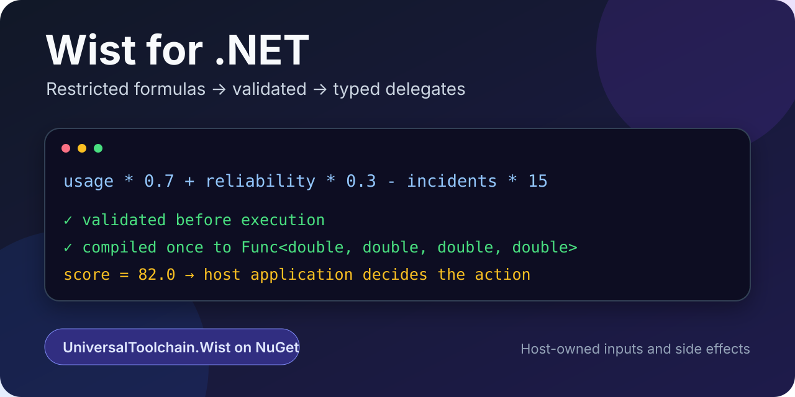

# Wist for .NET

[](https://www.nuget.org/packages/UniversalToolchain.Wist/0.1.0-alpha.1)
[](https://www.nuget.org/packages/UniversalToolchain.Wist)

<p align="center">
  
</p>

**Validate restricted formulas, then compile approved rules into typed .NET delegates.**

`UniversalToolchain.Wist` is the first-contact package for .NET applications that need configurable numeric logic without exposing a broad scripting language. Your application owns inputs, authorization, persistence, resource isolation, and side effects.

UniversalToolchain is the modular compiler/runtime framework underneath Wist. Start with the package and practical formula API; explore dialect composition, AIR, backends, and experimental SSA only when you need the framework internals.

## Try Wist in 60 seconds

Install the public alpha:

```bash ci-run=false
dotnet add package UniversalToolchain.Wist --version 0.1.0-alpha.1
```

Compile a reviewed rollout formula once and invoke the typed delegate repeatedly:

```csharp
using UniversalToolchain.Wist;

using var rules = WistEngine.CreateRestrictedArithmetic();

const string formula =
    "usage * 0.7 + reliability * 0.3 - incidents * 15.0";

var validation = rules.Validate(
    formula,
    new { usage = 100.0, reliability = 90.0, incidents = 1.0 });

if (!validation.IsValid)
    throw new InvalidOperationException(validation.Message);

var rolloutScore = rules.Compile<Func<double, double, double, double>>(
    formula,
    "usage",
    "reliability",
    "incidents");

double score = rolloutScore.CompiledDelegate(100.0, 90.0, 1.0);
bool enableNewDashboard = score >= 80.0;
```

The formula returns data. The host application decides what the result means and performs the action.

Run the included source demo from the repository root:

```bash ci-timeout=240
dotnet run --project samples/Wist.RolloutScoring/Wist.RolloutScoring.csproj
```

Expected product-level output:

```text
Wist restricted formula demo

formula: usage * 0.7 + reliability * 0.3 - incidents * 15.0
✓ validated before execution
✓ compiled once to Func<double, double, double, double>
✓ score: 82.0 -> enable dashboard: True
✗ rejected a statement-style rule before execution

The formula returns data. The host application owns the action.
```

For lower-level dialect and backend demonstrations, use `UniversalToolchain/Example/Example.csproj`.

## Rejection before execution

The restricted arithmetic preset intentionally starts narrow. A broader statement-style shape is rejected by that preset:

```csharp
var rejected = rules.Validate(
    "let score = usage * 0.7\nscore",
    new { usage = 100.0, reliability = 90.0, incidents = 1.0 });

Console.WriteLine(rejected.IsValid); // false
Console.WriteLine(rejected.Message); // structured validation failure
```

This is language-surface restriction, not a hardened sandbox. Arbitrary hostile input still requires process/environment isolation, resource limits, and an explicit threat model.

## What Wist gives a .NET host

| Need | Public alpha surface |
|---|---|
| Validate without throwing | `Validate(...)` |
| One-off trial execution | `Evaluate<T>(...)` |
| Compile once, invoke many times | `Compile<TDelegate>(...)` |
| Non-throwing compilation | `TryCompile<TDelegate>(...)` |
| Stable diagnostic shape | codes, severity, stage, span, message, hints |
| Host-owned preflight limits | source length and parameter count |
| Two execution paths | interpreter-oriented diagnostics/parity and CIL-oriented typed invocation |
| Optional optimizer experiment | observable, opt-in `AIR -> SSA -> AIR` route |

## When Wist fits

Use Wist when:

- JSON or configuration is starting to become logic;
- an expression evaluator is too small for the product direction;
- C# scripting exposes more language surface than the application wants to own;
- user, admin, configuration, or LLM-suggested formulas must be validated before execution;
- the same approved formula should become a typed delegate for repeated invocation;
- interpreter/compiler semantic parity matters for the language contract.

Do not use the current alpha when:

- you need a hardened in-process sandbox for arbitrary untrusted code;
- you need a stable 1.0 compatibility promise today;
- broad C# scripting is the intended product surface;
- a single hardcoded calculation is simpler and sufficient.

## Current alpha scope

| Capability | Status |
|---|---|
| `WistEngine` facade | available in `UniversalToolchain.Wist` |
| Restricted arithmetic preset | `CreateRestrictedArithmetic()` |
| Broad native preview preset | `CreateFullNative()` with explicit host assembly allowlist |
| Typed compiled hot path | `Compile<TDelegate>()` |
| Interpreter path | diagnostics, fallback, and semantic parity work |
| Dialect composition | shipped `.wistdialect` profiles and lower-level APIs |
| Experimental SSA route | opt-in, observable, verifier-gated |
| Full business-rule platform | direction, not a current claim |
| Hardened sandboxing | not claimed |

## Performance model

Use `Evaluate<T>` for onboarding, admin trial runs, tests, and non-hot paths. Use `Compile<TDelegate>` when the same formula is invoked repeatedly:

```csharp
var formula = rules.Compile<Func<double, double, double>>(
    "usage * weight",
    "usage",
    "weight");

for (var index = 0; index < usages.Length; index++)
    results[index] = formula.CompiledDelegate(usages[index], weights[index]);
```

Benchmark compiled delegate invocation separately from parsing and compilation. The project does not claim that every Wist program outperforms handwritten C#.

See [the public performance model](docs/public/performance-model.md) for benchmark boundaries and interpretation.

## UniversalToolchain underneath Wist

```text
Source
  -> Lexer / Parser
  -> AST
  -> Bytecode
  -> AIR
  -> Optimizers
  -> Compiler / Interpreter
  -> Execution
```

The framework keeps language features composable, runtime selection dialect-driven, and shared semantics protected by interpreter/CIL parity tests. Wist is the reference language and the packaged first-contact experience.

Technical material:

- [Project documentation](docs/index.md)
- [Installation and clean-room smoke](docs/start/installation.md)
- [Use-case recipes](docs/start/use-case-recipes.md)
- [Alpha stability contract](docs/public/what-is-stable-in-alpha.md)
- [Architecture guardrails](docs/ARCHITECTURE_RULES.md)
- [LangDev 2026 proposal](docs/talks/langdev-2026/README.md)

## Build and verify from source

Use the canonical repository entrypoint:

```bash ci-run=false
./build.sh
```

Useful bounded variants:

```bash ci-run=false
./build.sh --skip-docs
./build.sh --skip-docs --skip-pack
```

The wrapper performs serial restore/build for the current project graph, runs the test projects, packs the public facade, checks package-surface growth, builds documentation, and runs Markdown checks.

## Contributing

External feedback is most useful when it describes observed behavior:

- could you reach the first numeric result without opening architecture documentation;
- where did installation or the API make you hesitate;
- which real formula would you try in an application;
- which diagnostic or trust boundary was unclear;
- what would stop you from using Wist in a small internal tool.

Read [the contribution guide](docs/CONTRIBUTING.md). Small documentation, diagnostics, examples, and clean-room compatibility improvements are welcome.

## Maintainer launch material

- [Promotion kit](docs/maintainers/promotion-kit.md)
- [Repository settings and launch checklist](docs/maintainers/repository-settings.md)
- Social/README artwork: [`docs/assets/wist-social-preview.svg`](docs/assets/wist-social-preview.svg)

## License

Licensed under Apache License 2.0. See [LICENSE](LICENSE).
